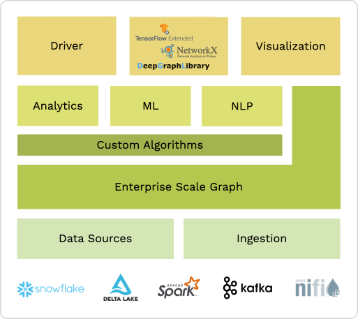
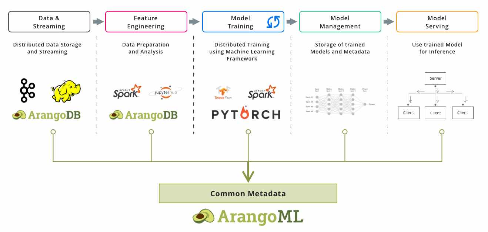

# Graph ML is the future of data analytics

[By 2025, graph technologies will be used in most of data and analytics innovations.](https://www.techrepublic.com/article/gartner-top-10-data-and-analytics-technology-trends-for-2021/)

### ArangoDB as the foundation for Graph ML
* **Scalable**: Designed from ground up to scale Enterprise use cases 
* **Simple** Ingestion: Easy integration in existing data infrastructure + connectors to all leading data processing and data ecosystems
* **Open Source**: Extensibility, Community, especially large community maintained library
* **NLP Support**: Built-In Text Processing, Search, and Similarity Ranking
  
  
---
<table>
 <tr>
    <td width="50%"><b style="font-size:20px">ArangoPipe</b></td>
    <td width="50%"><b style="font-size:20px">NetworkX Support</b></td>
 </tr>
 <tr>
    <td>
        

          <a href="https://github.com/arangoml/arangopipe">ArangoML Pipeline</a> is a common and extensible Metadata Layer for Machine Learning Pipelines which allows Data Scientists and DataOps to manage all information related to their ML pipeline in one place. Get started in .
            
          

        

    </td>
    <td>
        

          The <a href="https://github.com/arangoml/networkx-adapter">ArangoDB-Networkx Adapter</a> exports Graphs from ArangoDB into NetworkX, the swiss army knife for graph analysis with python, and vice-versa. Developers can use this adapter to extend ArangoDB graph compatibility to <a href="https://www.dgl.ai/">DGL</a>, <a href="https://networkit.github.io/">NetworkKit</a>, and <a href="https://www.pyg.org/">PyTorch Geometric</a>, via their own NetworkX support. Get started in .
        

         
        

          
          
          
          
        

    </td>
 </tr>
</table>

<table>
 <tr>
    <td width="33%"><b style="font-size:20px">Graph Embeddings Service</b></td>
    <td width="33%"><b style="font-size:20px">NVidia Triton</b></td>
    <td width="33%"><b style="font-size:20px">Pregel</b></td>
 </tr>
 <tr>
    <td>
        

          The <a href="https://github.com/arangoml/embeddings-service">Embeddings Service</a> is a Foxx tool that enables the generation of embeddings.
            
          

        

    </td>
    <td>
        

          <a href="https://github.com/arangoml/embeddings-compute">NVidia Triton</a> is the product of ArangoDB partnership with Nvidia to make deploying models within the ArangoDB ecosystem fast and efficient.
            
          

        

    </td>
    <td>
        

          ArangoDB has built-in Pregel support that allows for analytical processing directly on graphs stored in ArangoDB. Get started <a href="https://www.arangodb.com/docs/stable/graphs-pregel.html">here</a>.
        

     </td>
 </tr>
</table>

---
 

**Learn more from our resources at [arangodb.com/learn](https://www.arangodb.com/learn/)**
